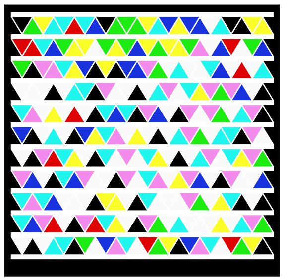

# High Capacity Color Barcode (HCCB)

This is a Python library that displays data as HCCB (High Capacity Color Barcodes). It builds SVG elements based on the data to be displayed.

## Why?

I saw today (July 5, 2024) that [this guy](https://github.com/canadaduane/elm-hccb) wrote a library for HCCB in the elm language, which is really niche, so I translated it to Python using Claude 3.5 and GPT 4o and added Reed-Solomon ECC, but there seems to be some problems.
I mainly saw that someone had reproduced a version and wanted to try it out for myself, so I gave it a brief try and found problems in so many places. The reader is even more remote, after all, Microsoft has abandoned the project, I just play, we can work together to enrich the project.

## License

BSD3 Licensed. Feel free to do what you want with this code; however, HCCB is patented by Microsoft and I have no idea if they want you to use HCCB or not.